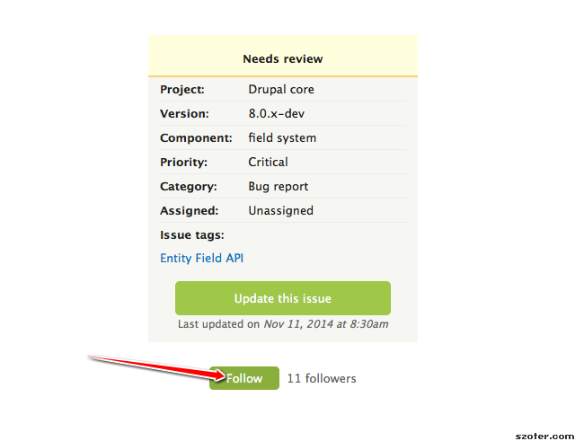
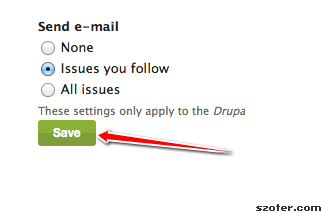
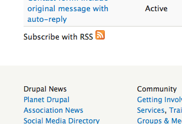
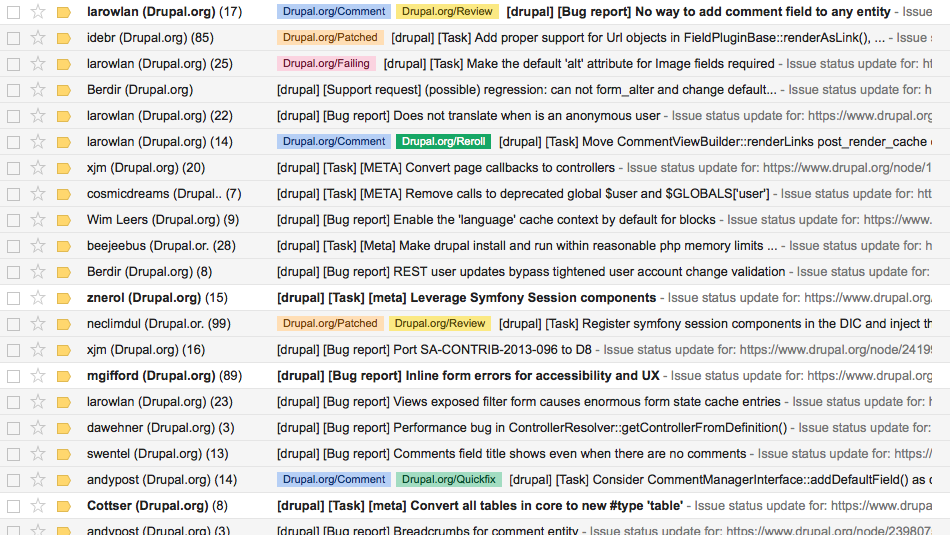
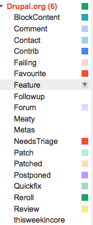

# Contributing  to core

## Without losing your mind

Lee Rowlands

drupal.org/u/[larowlan](https://drupal.org/u/larowlan)
twitter/[@larowlan](https://twitter.com/larowlan)

---

## The who slide

Source: http://alldylan.com/wp-content/uploads/2013/05/The+Who.jpg

Note:

- I was told my second slide should be the who slide
- maintain 4 modules in core
- near 350 commit mentions in d8
- number 12 contributor to d8
- sec team
- senior drupal dev at pnx
- doing this since 2008
- frustration with d7 changes as catalyst

---

## Where it all starts

--

## Register

 

Note:

- if you don't have an account, get one now, even if you don't want to comment
- I wish I had have registered earlier - waited until I needed to post a patch

--

## What is Drupal?

Note:

- content modelling
- cms
- the community

--

## Are you missing 33%?

Source: https://deadhomersociety.files.wordpress.com/2012/02/kingsizehomer8.png

Note:

- IRC is window to the community

--

## Get on IRC
 

--

## Where to say hi

- \#drupal-au
- \#drupal-contribute

Note:

- I was a freelancer for many years sime told me to get on drupalau
- window to the community

--

## IRC Resources

- drupal.org/irc

--

## IRC Clients

- pidgin
- limechat
- adium
- web client on freenode

---

## Negotiating issue queues

Note:

- Start slow
- Don't have a drupal.org account - get one now! user/register

--

## First step - watch an issue

Note:

- Start by watching issues

--

## Step 2 - setup email  notifications

Note:

- Make sure your email settings are sane

--

## Step 3 - Observe

Source:http://bit.ly/1zHPFfq

--

## Step 4 - Absorb

Note:

- Get to know the personalities
- Observe the interactions and process

---

## Finding your niche

--

## Scratch an itch

--

## Find something that  annoys you

--

## Find something that  *you* care about

--

## Find something  *no-one* cares about

--

## Find something

--

## Use the tools

- Issue queue search
- RSS feed
- 

--

## Find what works for you

--

## I use Gmail tags

--

## Find something that suits my mood

---

## Git and patch workflows

--

## One branch per issue

--

## Commit your patches locally

--

## Everything is easier

- **interdiff** > git diff > interdiff.txt
- **re-roll** > git fetch origin && git merge origin/8.0.x
- **patches** > git diff origin/8.0.x > some-file.patch
- **applying** > curl http://drupal.org/files/some-file.patch | git apply

---

## Dealing with politics and  personalities

--

## Egos are big

--

## Stakes are high

--

## Sleep on it

--

## Don't get drawn into the  Karpman Drama Triangle

[Sad it has a name](http://en.wikipedia.org/wiki/Karpman_drama_triangle)

Note:
- Avoid being the victim
- Avoid being the persecutor
- Avoid being the rescuer

--

# Sometimes...

Source:http://www.vh1.com/celebrity/bwe/images/2011/06/Stop-That-Mr-Simpson-1308333673.jpg

Note:
- Sometimes people are just jerks.

--

## Ask questions when unsure

--

## Real-time communications   &gt; issue queues

- Solving things much easier on IRC.

--

## Call out inappropriate behaviour

- Silence = acceptance
- [Constructive feedback](https://www.drupal.org/constructive-feedback)

Note:
- Explain process
- Yeah there's a u in that

--

## Don't forget language barriers

Note:

- Not everyone speaks English as their first language
- Don't take offence at language quirks
- Be prepared to explain local slang and lingo

--

## Switch off

Note:

- Best way to avoid burnout is drift in and out
- Have a live outside Drupal

---

## Not sweating details

--

## If you patch it, they will come

Note:

- What will come? re-rolls, reviews, new-patches, feedback, commit mentions
- https://www.drupal.org/node/1821620

--

## Review trades

Note:

- Everyone has their own pet issues

--

## A broken patch is better than none

Note:

- It doesn't have to be perfect

--

## Magic fairies in the night

Note:

- Timezones have some benefits

---

## Development approaches

- [A tale of two developers](http://webchick.net/embrace-the-chaos)

Note:

- embrace the chaos

--

## Sloppy Sam

Note:

- Asks on IRC if anyone knows about it
- Follows leads from community
- Puts up half-baked patch
- Learns from reviews
- Reviews others work
- Rapid increments

--

## Perfectionist Pat

Note:

- First patch is perfect
- Works in isolation
- Slow feedback loop
- Concerned about perceptions
- Fails to build karma/reputation

---

## Learning through reviews

--

## Core is vast

--

## You cannot know everything

--

## Seriously

--

## Reviewers teach as they review

--

## Reviewers learn as they go

--

## Explore new areas as  a reviewer

--

## Learn new techniques as  a reviewee

--

## Get a free CS education

---

## Building networks and  friendships

--

## How do you know who  handles *X*?

--

## Maintainers.txt

--

## From observation

--

## Ask on IRC

--

## Build networks

--

## Build karma

--

## Build respect

--

## Build comrades

--

## Build friends

---

## Automating your processes with phing

--

## Automation > remembering stuff

- phing simpletest:class
- phing reinstall
- https://github.com/nickschuch/vd8/blob/master/build.xml

Note:

- Simpletest commands
- Reinstall
- PHP Unit testing

--

## Git aliases

- git interdiff
- git merge8x
- git genpatch {number}
- git fetchpatch {url}
- https://gist.github.com/larowlan/18624d5554c52e90c613

---

## Automated tests

--

## Don't be afraid

--

## Become a better developer

--

## Transfer skills learned to dayjob

--

## Sleep easier

---

# Resources

- http://hojtsy.hu/blog/2014-jun-24/how-manage-drupalorg-issues-according-your-priorities
- http://drupal.org/dcoc
- http://randyfay.com/content/what-can-drupal-community-do-about-burnout
- http://sydney2013.drupal.org/show-me-tests-writing-automated-tests-drupal

---

# Questions?

---

## See you at the sprint

<larowlan@previousnext.com.au>

[@larowlan](https://twitter.com/larowlan)
